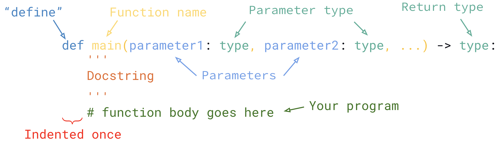

# 5.2 Functions - Return Values

The functions we saw last time all printed something. But sometimes, we don't always want it to print. We just want it to gives us a value or more specifically, **return** a value.

Consider the function `math.sqrt()`. If we were to type: `math.sqrt(9)` into a Python file and run it, nothing will happen. But we know it will give us `3.0`. Why does this happen?

The function is not **printing** anything, instead it is **returning** a value. This value can be stored in a variable to be used later on. Instead, we would write:
```python
square_root = math.sqrt(9)
print(square_root)
```

#### Syntax Reminder:


Today, we're going to look at what the `-> type` does and what the `return` statement is.

## `return` Statement
* Indicates the value that the function returns
* Used to exit a function and return a value that can be assigned to a variable
* Can have multiple return statements but only one value can be returned at a time
* Once a return statement is executed, the function is complete.
* Exiting the function with return ends the function

## The return type
Syntax:
```python
-> type:
```
* Indicated in the function definition at the very end
* This represents the data type the function will return (e.g. `int`, `float`, `boolean`)
* NOTE: A function does not need to have a return type

## Function Best Practices
When designing functions, the best functions (aka pure functions) have the following characteristics:
* Takes arguments
* Returns a value
* No print or input

## Example
Let's look at the example from Lesson 5.1 where we created a function that prints the area of a rectangle with parameters `length` and `width`. Instead of printing the area, let's have the function return the value instead and specify what the retun value should be. Then, we'll put it into use.
### Part (a) Create a function that will return the area of a rectangle.

Before:
```python
def area_rect(length: float, width: float):
  area = length * width
  print(area)
```

With return values and return type:
```python

```

### Part (b) Use your function by calling it
```

```

<span style="color:red">
<b>NOTE: calling a function with a return value will not print</b>
</span>